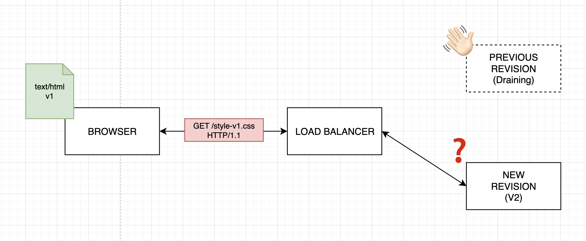

import { Helmet } from "react-helmet";

<Helmet>
  <meta
    name="description"
    content="Next.js 애플리케이션 배포 시 발생할 수 있는 화이트아웃 문제를 해결하는 방법에 대해 알아봅니다."
  />
  <meta
    name="keywords"
    content="Next.js, AWS ECS, 배포, 화이트아웃 문제, 프론트엔드"
  />
  <meta
    property="og:title"
    content="Next.js 서버 인스턴스 배포할때 나타나는 화이트아웃 현상을 고쳐보자"
  />
  <meta
    property="og:description"
    content="AWS ECS Fargate에서 Next.js 애플리케이션 배포 시 발생할 수 있는 문제를 해결하는 방법."
  />
  <meta
    property="og:url"
    content="https://wonkooklee.github.io/blog/240411-nextjs-deploy-strategy"
  />
  <meta property="og:type" content="article" />
  <meta property="og:image" content="/path-to-image.jpg" />
  <meta name="twitter:card" content="summary_large_image" />
</Helmet>

## Next.js 서버 인스턴스 배포할때 나타나는 화이트아웃 현상을 고쳐보자

> **요약**  
> AWS ECS Fargate를 통해 Next.js 서버 인스턴스를 운용하고 있었는데, 새 배포 버전으로 태스크가 개정(revision)되면서 이전 인스턴스가 사라져서 Next.js 애플리케이션의 정적 자원(static)을 찾지 못해 404가 떨어지는 케이스를 해결했습니다.
>
> 정적 자원을 assetPrefix 옵션을 사용해서 별도의 CDN에 업로드해서 배포 개정이 이루어져도 자원을 찾지 못하는 문제를 인프라 구조를 개선해서 해결한 내용입니다.

안녕하세요, 저는 웹 프론트엔드 개발자입니다.

Next.js를 사용하신다면 서버 인스턴스를 어느 플랫폼에 호스팅하시나요?

Vercel에서 제공하는 호스팅 서비스를 사용하시는 분도 계실 것이고, AWS(EC2, ECS, EKS, Amplify 등), GCP, Azure와 같은 관리형 Sass를 사용해서 서버 런타임을 운용하고 계실 겁니다.

저는 실무에서 AWS ECS Fargate 환경에서 Next.js 앱 인스턴스를 띄워 운영하고 있습니다.
가용 리소스와 트래픽에 맞추어 컴퓨팅 리소스를 탄력적으로 관리할 수 있다는 점에서 ECS를 매우 편리하게 사용하고 있습니다.

하지만 언제나 그렇듯 기술을 제대로 이해하고 사용하지 않으면 예기치 못한 문제를 맞이하게 됩니다.

작년, 새로운 배포판으로 개정(revision) 할때 화면이 하얗게 나오는 white-out 현상을 인지했고 어떤 인프라 구조와 배포 방식으로 대처할 수 있었는지 소개해드리고자 합니다.

<br />

---

<br />

## 현상 이해하기

### 정적 웹 리소스 요청의 라운드 트립

웹서버로 요청이 들어오면 HTML 문서를 반환합니다. 브라우저는 HTML 문서를 차례대로 파싱하며 명시된 여러 정적 리소스를 제공받은 태그에 명시된 소스 URL로 요청하게 됩니다.

클라이언트가 ECS Fargate 컨테이너의 웹서버에서 웹 소스를 받아오는 라운드 트립을 설명을 위해 매우 단순하게 그려보았습니다.


> 클라이언트 브라우저에서 네임서버에 등록된 CNAME이 맵핑된 LoadBalancer에 요청을 보내고, ECS 클러스터의 각 서버 인스턴스에 트래픽을 할당하는 정도만 대강 표현했습니다. (HTTP/2 등은 신경쓰지 않고 그렸으니 순서가 이상해도 양해 부탁드립니다 )

요청 패턴에 따라 트래픽을 꺾어주는 등 별도의 작업을 하지 않으면 같은 목적지로부터 리소스들을 받아옵니다.
리소스 요청 이터레이션은 아래와 같이 HTML document 요청을 선두로 필요한 정적 리소스 요청 캐스캐이딩이 이뤄지고 있는 것을 통해 확인할 수 있습니다.


### 잦은 배포 주기와 이전 버전의 드레이닝으로 인한 리소스 not found 에러

배포 주기가 길거나 트래픽이 없는 시간대에 조용히 진행한다면 큰 이슈가 되지 않을 수 있습니다.

하지만 저희처럼 배포 주기가 잦고 상시적으로 버전 개정이 발생된다면 정적 리소스를 별도의 방식으로 관리해주어야 합니다.

태스크 개정(Revision)되는 타이밍에 운나쁘게 걸린 트래픽이 있다면 정적 자원을 찾지 못해 서비스 화면을 제공하지 못할 수 있습니다.


예를 들어 클라이언트의 최초 요청은 HTML V1 버전이며 모든 static asset의 참조 경로가 V1 기준으로 되어 있다고 가정합니다.

그 사이 새로운 버전의 태스크가 가동을 시작하고 있습니다. Load Balancer에선 인스턴스의 health check를 통해 가동 여부를 계속 확인하며 언제 트래픽을 전환해줄지 타이밍을 재고있습니다.



브라우저에서 V1 기준의 자원을 찾는 요청을 보냈으나 이미 V1 자원을 서빙하던 서버 인스턴스는 드레이닝되어 트래픽을 더 이상 받지 않고, 새로운 V2 인스턴스가 트래픽을 이어 받습니다.

새로운 V2 인스턴스는 당연히 V1에 대한 정적 자원을 가지고 있지 않으므로 자원을 찾을 수 없다는 404 상태 코드를 반환합니다.

브라우저 콘솔에선 자원을 찾을 수 없다고 할 것이고


최초 자원 요청에 실패하여 화면은 하얗게 질려버리게 됩니다.


물론 새로고침을 해서 새로운 HTML을 받아오면 다시 자원을 잘 찾아오겠죠. 하지만 이미 사용자는 서비스를 정상적으로 이용할 수 없게 되었습니다.

인바운드 트래픽의 특정 조건에 따라 목적지 분배를 일시적으로 고정시켜주는 sticky session도 문제를 해결할 순 없습니다. 왜냐하면 정적 자원이 만들어질때 번들링된 각 페이지의 정적 파일들은 빌드할 떄마다 파일명이 난수화됩니다.

난수화되는 파일명을 고정 값으로 바꿀 수도 없는 노릇입니다. 왜냐하면 클라이언트 사이드의 브라우저 캐싱으로 인해 stale asset이 남을 위험이 있기 때문입니다.

<br />

---

<br />

## 배포 전략의 문제인가? - 배포 전략에 대한 간단한 이해

서비스에서 요구되는 방식에 따라 롤링, 블루그린, 카나리 등 다양한 배포 전략이 존재합니다.
롤링, 블루-그린, 카나리와 같은 대표적인 배포 방식에 대해 간단히 짚고 넘어갑니다.

### 롤링 (Rolling)


점진적으로 배포를 실행시키며, 새로 개정된 배포 버전과 이전 배포 버전이 일시적으로 공존할 수 있습니다. 일반적인 관리형 서비스에서 인스턴스에 대한 별도의 배포 전략을 설정해놓지 않는다면 보편적으로 롤링 방식을 사용하게 됩니다.

### 블루/그린 (Blue/Green)


블루/그린 배포 전략에선 이전 배포 버전과 다음 배포 버전의 대상 그룹들을 각각 Blue와 Green이라고 칭합니다.

새롭게 배포되는 서버의 구축이 완료되면 로드밸런서를 이용해서 이전 배포 그룹(Blue) 새 배포 그룹(Green)으로 트래픽 라우팅을 단번에 전환합니다.

### 카나리 (Canary)


변경 사항을 천천히 점진적으로 릴리즈하여 새로운 프로덕션 배포에서 발생할 수 있는 위험을 미리 감지하고 대응할 수 있게 하는 배포 방식입니다. 카나리는 광산에서 깊은 갱도로 들어갈때 유독 가스에 민감한 카나리아를 함께 데려가 위험을 미리 인지하는 것에서 유래되었습니다.

API 서비스만 제공하는 서버 인스턴스라면 몰라도 배포 전략을 바꾼다고 우리의 문제가 해결되지는 않습니다.

근본적으로 정적 자원 요청 트래픽을 앞단에서 CDN으로 꺾어주어야 합니다.

<br />

---

<br />

## 정적 자원을 위한 별도의 CDN

근데 Next.js 애플리케이션이 떠있는 Fargate는 단일 요청을 처리하는 것으로 끝나는게 아니라, HTML을 전달하는 웹 애플리케이션 서버(WAS)이기 때문에 HTML 문서 응답 후 리소스 주소에 명시된 다른 자원들도 함께 전달해주어야 합니다.

여기서 API 서비스를 제공하는 일반적인 서버와는 약간 다른 방식으로 정적 자원의 경로를 틀어주어야 합니다.

블루/그린 등의 배포 전략을 사용하더라도 사용자가 이미 HTML 문서를 받은 상황에서 운나쁘게 개정 타이밍이 어긋나거나 요청 지연이 발생한다면 HTML에 명시된 정적 자원들은 이미 드레이닝되어 찾을 수 없는 Not Found 상태가 됩니다.

따라서 정적 자원들의 리소스 주소를 중복되지 않도록 unique 값을 활용하여 요청을 꺾어주면 배포 개정 타이밍에 정적 자원들이 엇갈리는 문제를 해결할 수 있습니다.


간단히 도식으로 나타내면 위와 같은 구조로 개선해보았습니다.
배포 순서부터 차례로 설명드리자면

1. Ci 러너 인스턴스에서 Next.js 애플리케이션의 빌드 프로세스가 완료되면 서버 런타임을 띄우기 위한 도커 이미지는 ECR과 같은 레지스트리로, static asset으로 추출된 JS, CSS 등 정적 자원들은 S3와 같은 스토리지에 배포 태그를 달고 업로드 됩니다.
2. 정적 자원은 별도의 호스트 주소를 가지는 CDN에 원본으로 연결되어 버전에 따라 언제든지 해당 자원을 서빙할 수 있습니다.
3. Next.js 애플리케이션 서버 인스턴스는 개정으로 인해 정적 자원의 누락을 걱정하지 않고 언제든지 배포 개정을 수행할 수 있습니다.


<br />

---

<br />

## Next.js + Docker를 사용한 Ci 자동화

Next.js에는 정적 자원의 리모트 주소를 별도로 맵핑할 수 있는 assetPrefix라는 옵션이 있습니다.

[next.config.js Options: assetPrefix | Next.js](https://nextjs.org/docs/app/api-reference/next-config-js/assetPrefix)

assetPrefix를 사용해서 정적 자원을 서빙하는 인프라에 업로드한 후 배포에 대응하는 고유한 경로를 설정하면 자원을 찾지 못하는 이슈에서 해방될 수 있습니다.

```js
// assetPrefix 사용 예시

const isProd = process.env.NODE_ENV === "production";

module.exports = {
  // Use the CDN in production and localhost for development.
  assetPrefix: isProd ? "<https://cdn.mydomain.com>" : undefined,
};
```

만약 Docker를 사용해서 애플리케이션을 빌드하실 경우 static build 파일을 추출해서 지정된 위치로 업로드 해주어야 합니다.

저같은 경우 AWS를 서비스 프로바이더로 사용하고 있으니 S3에 업로드 합니다.

단 어떻게 static 파일을 추출할 수 있을까요?

docker create 명령을 사용해서 생성된 이미지를 사용한 도커 컨테이너를 일시적으로 띄우고 가상 컨테이너의 파일시스템으로부터 호출한 런타임 파일시스템으로 파일을 cp 명령어로 복사해올 수 있습니다.

```yaml
run: |
  docker create --name extractor {빌드_식별자}
  mkdir _next
  docker cp extractor:/{컨테이너_파일시스템_빌드에셋경로}/.next/static ./_next
  docker rm -f extractor
  aws s3 sync ./_next s3://{ 스토리지_리소스_주소 }/${{ 배포식별태그 }}/_next \
  --no-progress --cache-control ... (정적 자원 캐시 컨트롤 등)
```

위 스크립트를 차례대로 설명드리겠습니다.

```sh
docker create --name extractor {빌드_식별자}
```

빌드된 이미지를 사용해서 extractor라는 이름의 컨테이너를 만들어줍니다. 이 컨테이너는 내부 파일 시스템에 접근해서 정적 자원을 복사할 목적으로 만듭니다.

```sh
mkdir _next
docker cp extractor:/{컨테이너_파일시스템_빌드에셋경로}/.next/static ./_next
```

Next.js의 빌드 파일 경로는 보통 `.next`가 되는데 이는 URL 하위 경로로써 `_next` 에 대응합니다.
docker cp 명령어를 위와 같이 사용하면 특정 컨테이너 하위의 파일 시스템 경로로부터 커맨드를 실행한 호스트 머신 파일 시스템으로 파일을 복사할 수 있습니다.

```sh
docker rm -f extractor
```

컨테이너로부터 자원을 추출했다면 사용하지 않으므로 캐시가 남지 않도록 제거해줍니다.

```sh
aws s3 sync ./_next s3://{ 스토리지_리소스_주소 }/${{ 배포식별태그 }}/_next \
--no-progress --cache-control ... (정적 자원 캐시 컨트롤 등)
```

aws 커맨드라인 인터페이스를 통해 S3에 자원을 업로드합니다. 정적 자원은 CDN을 통해 배포되기 때문에 별도의 캐시 컨트롤을 명시해주는 등 목적에 맞게 설정합니다.

스토리지 리소스 하위 주소를 배포 식별태그로 만들어놓았으니 배포할때마다 차곡차곡 정적 자원이 쌓여나갈 겁니다. 특정 기간이 지나면 정책에 따라 플러싱을 해주면서 관리해주면 되겠습니다.

<br />

---

<br />

## Next.js 서버 런타임 + CDN 조합의 장점

저는 Next.js의 API 라우트 핸들러를 자주 활용합니다. 그리고 서버사이드에서만 수행할 수 있는 여러 작업들이 있기 때문에 서버 런타임이 필요합니다.

여기서 정적 자원을 CDN으로 배포하는 방식을 사용하면 정적 자원 요청에 대한 트래픽 부하도 줄일 수 있고 고객들은 위치상 통신 여건이 더 나은 엣지 로케이션으로부터 빠르게 자원을 전송받게 됩니다.

정적 자원을 누락 없이 빠르게 서빙할 수 있고, 서버 런타임을 통해 애플리케이션이 internal 통신 등 고객에게 쾌적한 서비스를 제공하기 위해 더 많은 일을 수행할 수 있다는 점에서 이번 개선은 꽤 뿌듯했습니다.

<br />

---

<br />

## 프론트엔드 개발자의 역할론

개인적으로 프론트엔드 개발자는 UI만 만지는거 아니냐는 말은 오해로부터 비롯되지 않았나 생각합니다.

제가 생각하는 프론트엔드의 역할은 고객과 직접 만나는 인터페이스까지 우리의 서비스를 잘 전달하기 위해 활용할 수 있는 기술을 발휘하는데 있다고 생각합니다.

그 역할을 수행하기 위해 API도 만들 수 있고, 인프라 구조를 개선할 수도 있으며, 책임질 수 있는 선에서 가용한 모든 자원을 활용할 수 있다고 생각합니다.

물론 분업과 전문화가 중요하고, 제가 작업한 수준은 실제 인프라, 네트워크 담당하시는 분들의 실력은 비할바가 못된다고 생각합니다. 누구나 전문 분야가 있고 약은 약사에게 라는 말이 있듯 이에 반론을 제기하는 것은 아니라는 점을 강조하고 싶습니다.

그저 우리가 궁극적으로 추구해야 할 목표가 무엇인지에 집중하고 그것을 이루기 위한 우리의 역할을 미리 단정짓지 말자는 정도로 마무리하고 싶습니다.

<br />

---

<br />

# 🙏🏻

**Wonkook Lee**  
Frontend Engineer  
[LinkedIn](https://www.linkedin.com/in/wonkook/)
